# ハンズオン

Video Indexer に動画をアップロードし、主要な機能を試して体感しましょう。

（所要時間：15 - 30 分）

## Video Intexer ポータルへサインイン

[ポータル（https://www.videoindexer.ai/）](https://www.videoindexer.ai/) にアクセスします。

サインインしていない場合は、以下の画面になりますので、画面右上の `サインイン` をクリックしてサインインしましょう（画面サイズによってはハンバーガーメニューになっている場合もあります）。

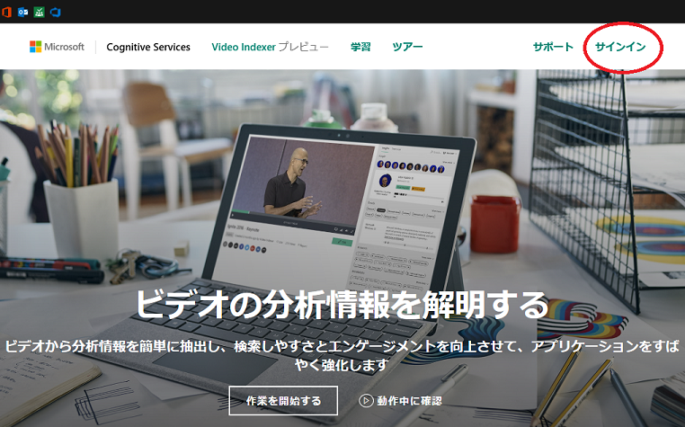

サインインできると、以下のポータルのトップ画面が表示されます。

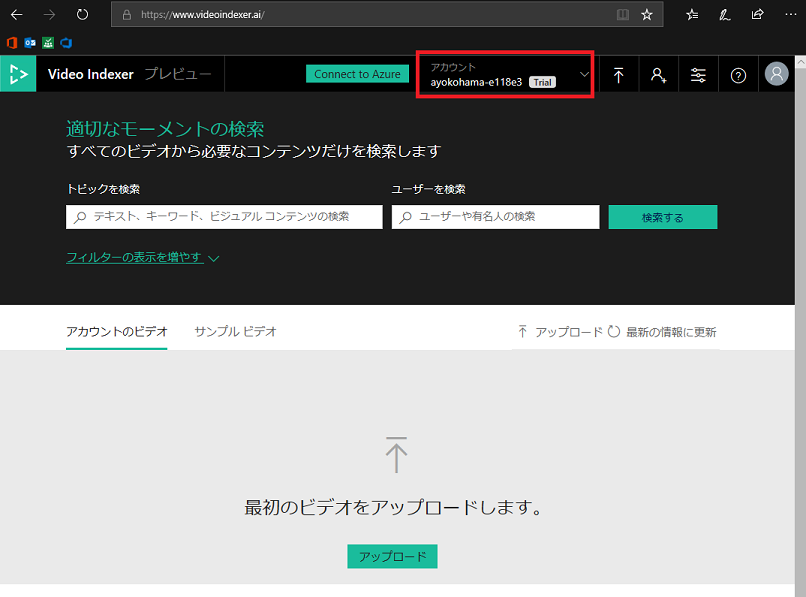

> **Tips:** デフォルトでは、Trial 版で無料で利用ができ、40 時間分の動画を解析することができます。残時間は、画面上部のアカウントをクリックして確認できます。

> **Tips:** Trial の上限を超えて利用したい場合は、Azure のサブスクリプションへ接続することで可能になります。その場合、有料になります。詳しくは[こちら](https://azure.microsoft.com/en-us/pricing/details/cognitive-services/video-indexer/)。

## 動画のアップロード

ポータルから動画をアップロード方法するには、2 通りあります。

* 動画ファイルをドロップする
* 動画ファイルを選択、または URL を入力する

今回は、URL を入力してアップロードを行います。

Video Indexer ポータルで、`アップロード` ボタンをクリックしましょう。初めて動画をアップロードする際は、ボタンが 2 箇所あります。どちらでも構いません。

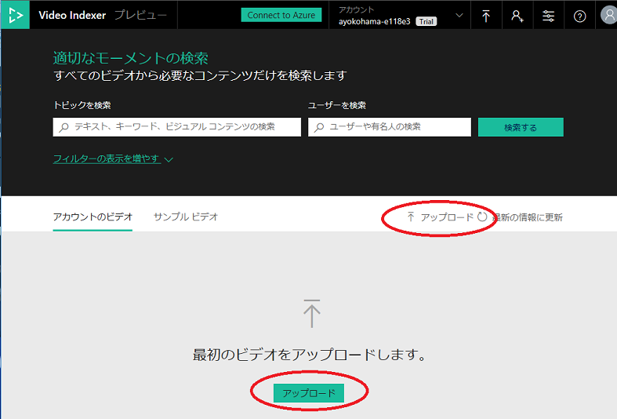

「ファイルの URL を入力する」をクリックします。

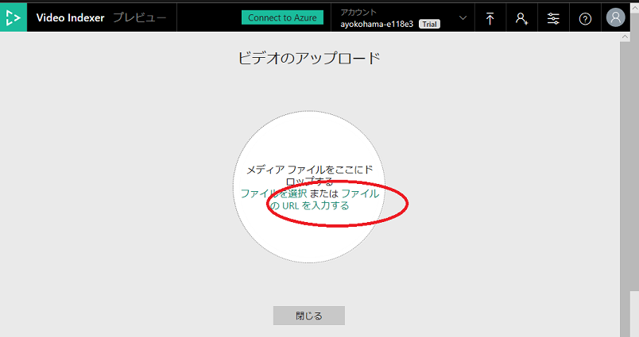

ここでは「Microsoft Build 2018: Seattle Sights」という Microsoft の動画を利用します。「URL を入力」以下の URL を入力しましょう。

`https://sec.ch9.ms/ch9/389a/8045145c-3b6b-499b-8000-3246d48c389a/02ThingsToSeeChristinaJamesFINAL_mid.mp4`

入力すると、入力項目がいくつか表示されますので、以下のように入力します。

* **ビデオ名:** 「Microsoft Build 2018: Seattle Sights」と入力
* **ビデオのソース言語:** 「英語」を選択
* **プリセット:** 「既定」を選択
* **プライバシー:** 「プライベート」を選択

入力が終わったら `アップロード` ボタンをクリックしてアップロードします。

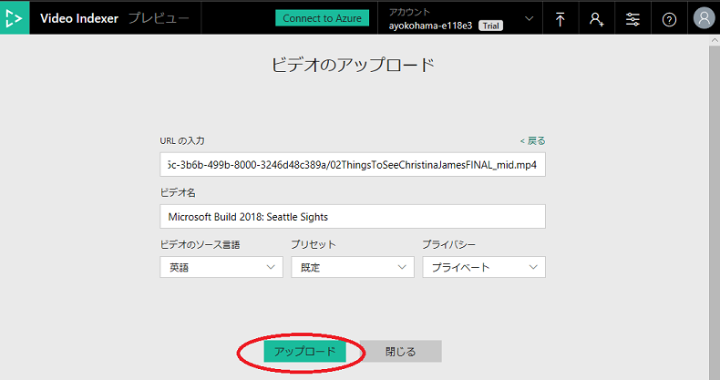

アップロードには少々時間がかかります（今回の動画だと 4 分程度を想定）。

動画のアップロードし、分析が完了するとメールの通知がきます。また、Video Indexer ポータルの「アカウントのビデオ」から選択ができます。

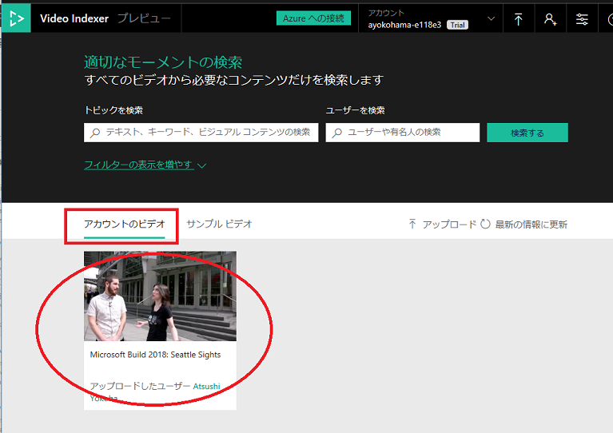

## アップロードした動画で見てみよう

主要な機能をいくつか操作してみていきましょう。アップロードした動画をクリックします。

### 人物の認識

画面右側の「洞察」タブの「ユーザー」では、認識された人物の一覧が表示されています。また、動画内で登場している時間もわかります。特定の時間をクリックして動画を見ることも可能です。

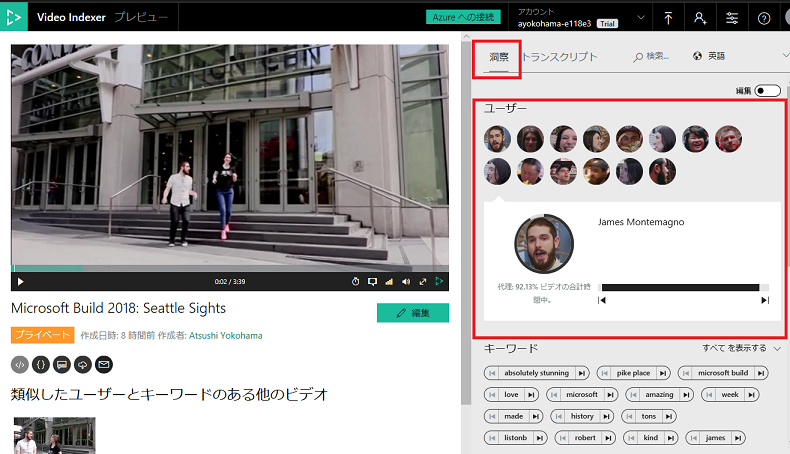

### キーワード / ラベル / ブランド

「ユーザー」の下方では、動画内の会話で認識できた「キーワード」「ラベル」「ブランド」が表示されます。それぞれをクリックして、検出された部分の動画を再生することが可能です。

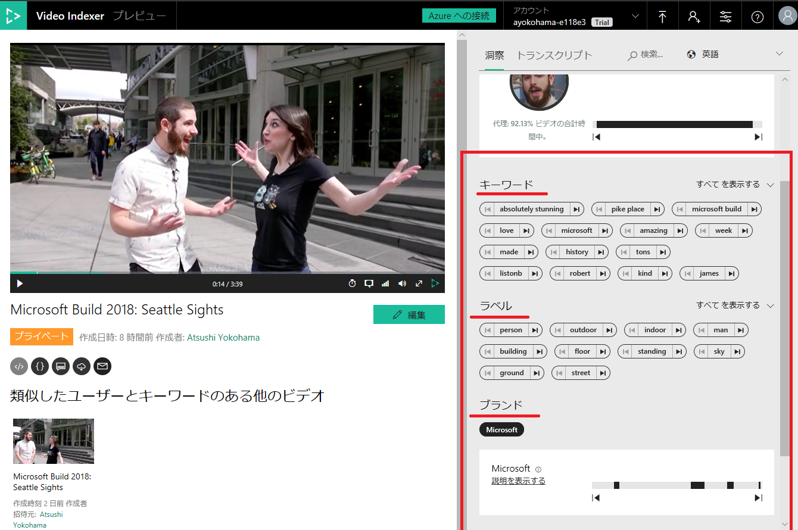

### 会話の感情

会話の内容からポジティブ / ネガティブを分析した結果を時間帯で表示します。クリックして動画にジャンプすることが可能です。

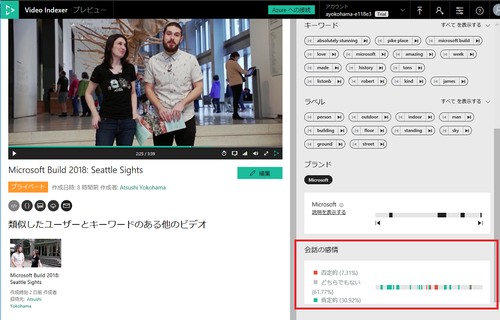

### トランスクリプト

次は、「洞察」のすぐ右にある「トランスクリプト」をクリックしてみましょう。

会話と、動画中で表示された文字を OCR で取得した結果が表示されます。誰が話しているかも表示されます。また、動画の再生に合わせて自動でスクロールすることが可能です。

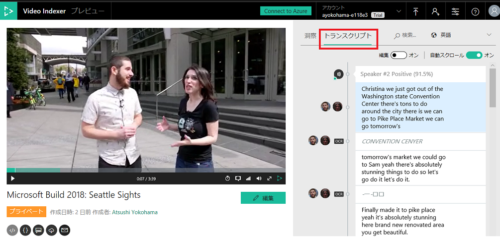

### 翻訳

言語を選択して、トランスクリプトの言語を切り替えることが可能です。日本語はもちろん、その他 50 以上の言語へ切り替えが可能です。

### 動画の表示

動画のビューアーでは、キャプションを表示することが可能です。デフォルトの言語と、トランスクリプトで選択している言語を選択可能です。

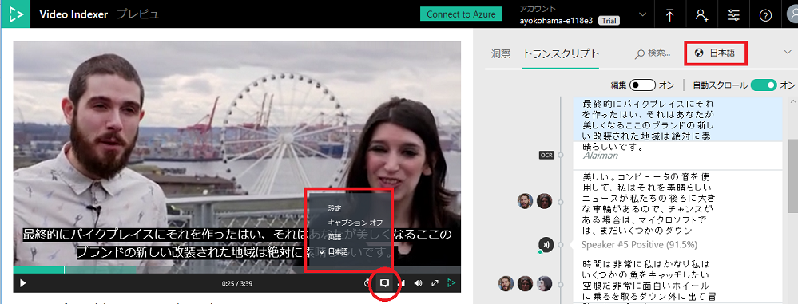

### 編集

トランスクリプトの抽出、翻訳、OCRなど、精度は完璧ではありません。編集ボタンをクリックしてトランスクリプトの修正が可能です

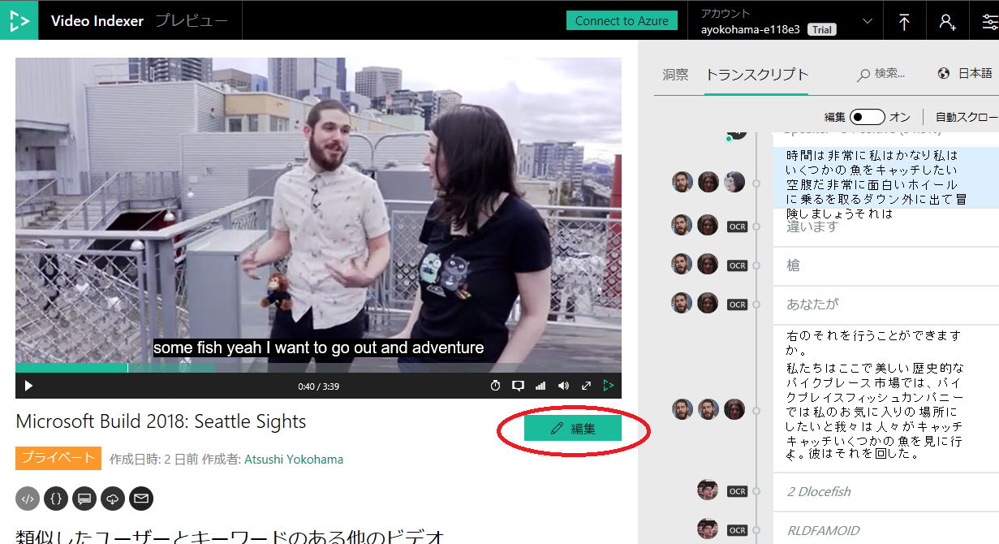

## まとめ

お疲れ様でした。今回のハンズオンは以上です。

Video Indexer を使って多くの分析を行うことができ、また、ポータルやAPI経由で分析結果の検索も可能です。分析の精度は完璧とは言えませんが、ゼロから自身でこのような分析を行うことと比べれば、大幅な時間やコストの削減になることが期待できるでしょう。

## NEXT STEP

ハンズオンで試したこと以外にも多くの機能があります。
また、ポータルからの操作のほかに、API 経由で処理をすることが可能できるため、プログラムを作って自動化なども可能です。

ドキュメントをみて、機能を試してみましょう。

[Video Indexer Documentation](https://docs.microsoft.com/ja-jp/azure/cognitive-services/video-indexer/video-indexer-overview)
[Video Indexer Documentation / Use Azure Video Indexer API](https://docs.microsoft.com/ja-jp/azure/cognitive-services/video-indexer/video-indexer-use-apis)
